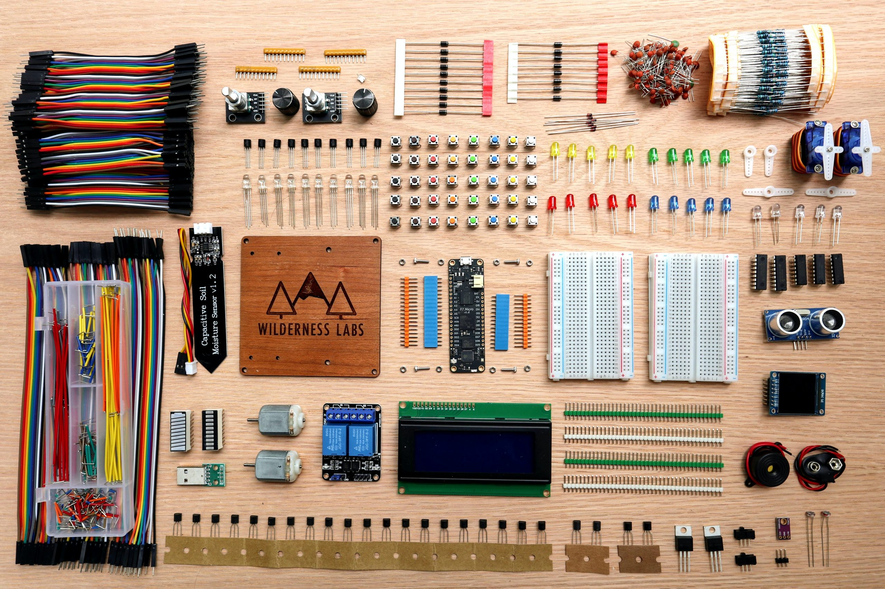

<!-- PROJECT LOGO -->
 

  

 
 

<!-- BACKGROUND & TITLE -->

  
  <h3 align="center">Electronic Materials</h3>
 

<!-- TABLE OF CONTENTS -->
## Table of Contents

* [**Notes**](https://github.com/MDBrodskiy/Electronic_Materials/tree/master/Notes/)
    * [**Bonding Overview**](https://github.com/MDBrodskiy/Electronic_Materials/tree/master/Notes/Lecture1.pdf)
    * [**Atomic Structure**](https://github.com/MDBrodskiy/Electronic_Materials/tree/master/Notes/Lecture2.pdf)
    * [**Ionic Bonding**](https://github.com/MDBrodskiy/Electronic_Materials/tree/master/Notes/Lecture3.pdf)
    * [**Covalent Bonding**](https://github.com/MDBrodskiy/Electronic_Materials/tree/master/Notes/Lecture4.pdf)
    * [**Metallic Bonding**](https://github.com/MDBrodskiy/Electronic_Materials/tree/master/Notes/Lecture5.pdf)
    * [**X-Ray Diffraction**](https://github.com/MDBrodskiy/Electronic_Materials/tree/master/Notes/Lecture6.pdf)
    * [**Conduction in Metals**](https://github.com/MDBrodskiy/Electronic_Materials/tree/master/Notes/Lecture7.pdf)
    * [**Semi-Conductors**](https://github.com/MDBrodskiy/Electronic_Materials/tree/master/Notes/Lecture8.pdf)
* [**Homework**](https://github.com/MDBrodskiy/Electronic_Materials/tree/master/Homework/)
    * [**Homework 1**](https://github.com/MDBrodskiy/Electronic_Materials/tree/master/Notes/HW1.pdf)
    * [**Homework 2**](https://github.com/MDBrodskiy/Electronic_Materials/tree/master/Notes/HW2.pdf)
    * [**Homework 3**](https://github.com/MDBrodskiy/Electronic_Materials/tree/master/Notes/HW3.pdf)
    * [**Homework 4**](https://github.com/MDBrodskiy/Electronic_Materials/tree/master/Notes/HW4.pdf)
    * [**Homework 5**](https://github.com/MDBrodskiy/Electronic_Materials/tree/master/Notes/HW5.pdf)
* [**Exams**](https://github.com/MDBrodskiy/Electronic_Materials/tree/master/Exams/)

<!--
  * [**Chapter 1**](#Notes/Chapter\ 1)
* [**Exams**](#Exams)
* [**Projects**](#Projects)
-->

An assortment of lecture notes and exams from Northeastern University's EECE3392 (Spring 2025)
    
Open sourced **LaTeX** Templates [here](https://www.latextemplates.com/).
 
**TikZ** diagram editor [here](https://www.mathcha.io/editor).
 
**TikZ** examples [here](https://www.texample.net/tikz/example).
 
**LaTeX** draw [here](https://www.latexdraw.com/).
     
Authentication:   
    <pre>to receive commit access to this repository e-mail Michael@Brodskiy.com for credential verification/authorization</pre>

Cloning This Repository
 &nbsp;&nbsp;with **command line interface**:
    <pre>    
    **$** git clone https://github.com/MDBrodskiy/Electronic_Materials.git    
    **$** **>**  **_**
    </pre>
